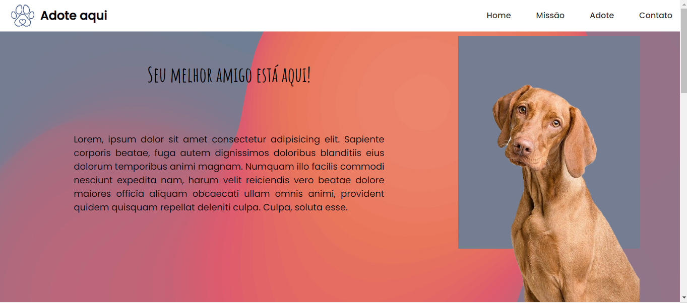

# Adote-AQui
Adote aqui é um projeto de uma ong de adoção de animais, proposto na segunda semana de aula na Resilia Educação 

 <h1>Tecnolgias Utilizadas</h1>
  
   

 

> Durante o Desenvolvimento do projeto pude colocar em pratica, a estruturação html , o posicionamento dos elementos utilizando flex-box e a aplicação de responsividade na página.

  

